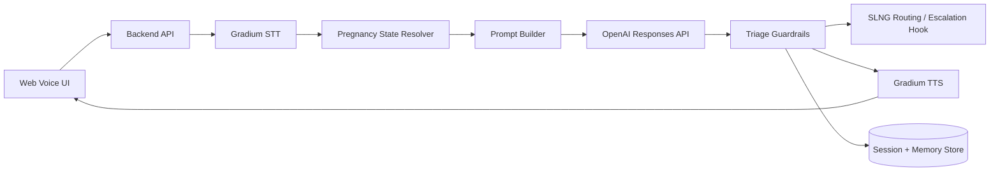

# MATERNAL ai Build Plan

## Goal

Build a simple hackathon MVP pipeline first:

```text
Mother voice input
  -> Gradium STT
  -> MATERNAL state + prompt context
  -> OpenAI LLM structured triage
  -> SLNG routing or escalation hook
  -> Gradium TTS
  -> Mother hears response
```

The first version should prove the core loop, not the whole clinical system.

## Current Scope

Connect:

- Gradium for speech-to-text and text-to-speech.
- OpenAI as the LLM reasoning and structured-output layer.
- SLNG as the voice-agent/session routing and escalation layer where supported.

Do not build yet:

- Full hospital integration.
- Real medical protocol ingestion.
- User authentication.
- Production-grade compliance.
- Full EHR integration.

## Safety Position

MATERNAL ai is not a doctor and does not diagnose.

The LLM can:

- Extract symptoms.
- Ask clarifying questions.
- Explain practical next steps.
- Format doctor summaries.
- Produce a risk classification candidate.

The deterministic app layer should own:

- Red/yellow/green thresholds.
- Emergency escalation rules.
- "Call emergency services" triggers.
- What can and cannot be answered.

## Technical Architecture



## Recommended MVP Stack

Frontend:

- Next.js app.
- One page with mic button, transcript, assistant response, phase selector, and triage badge.

Backend:

- Next.js API routes or FastAPI.
- Keep the first version simple.

Database:

- Start with JSON files or SQLite for hackathon speed.
- Move to Supabase Postgres later.

LLM:

- OpenAI Responses API.
- Use structured output so the app receives predictable JSON.

Voice:

- Gradium STT for transcribing user audio.
- Gradium TTS for speaking the assistant answer.

Routing:

- SLNG for voice-agent sessions, web sessions, human transfer, webhook-based escalation, or doctor routing.
- If direct SLNG integration takes longer, create an internal `routeEscalation()` adapter now and wire SLNG behind it later.

## Environment Variables

Use environment variables only. Never hard-code API keys.

```bash
OPENAI_API_KEY=
GRADIUM_API_KEY=
SLNG_API_KEY=
SLNG_AGENT_ID=
SLNG_BASE_URL=https://api.agents.slng.ai
APP_ENV=development
```

## First Pipeline Contract

### Request

```json
{
  "audioFile": "recorded-user-audio",
  "patient": {
    "id": "demo-user-1",
    "language": "en",
    "phase": "pregnancy_month_7",
    "ageRange": "25-34",
    "knownRisks": ["none"],
    "emergencyContact": "demo"
  }
}
```

### Response

```json
{
  "transcript": "I have a strong headache and my face feels swollen.",
  "phase": "pregnancy_month_7",
  "triage": "red",
  "assistantText": "These symptoms can be serious during pregnancy. I am flagging this as urgent and preparing a summary for your care team. If symptoms are severe or you feel unsafe, contact emergency services now.",
  "followUpQuestions": [
    "When did the headache start?",
    "Do you have visual changes, chest pain, shortness of breath, or severe abdominal pain?"
  ],
  "doctorSummary": {
    "reason": "Possible urgent pregnancy red flag",
    "symptoms": ["strong headache", "facial swelling", "dizziness if present"],
    "phase": "pregnancy_month_7",
    "urgency": "urgent_clinician_review"
  },
  "audioUrl": "/generated/assistant-response.wav"
}
```

## Pregnancy And Postpartum State Machine

Use a finite state machine so the AI always knows the mother context.

```text
positive_test
pregnancy_month_1
pregnancy_month_2
pregnancy_month_3
pregnancy_month_4
pregnancy_month_5
pregnancy_month_6
pregnancy_month_7
pregnancy_month_8
pregnancy_month_9
birth
postpartum_week_1
postpartum_week_2
postpartum_week_6
postpartum_month_3
postpartum_month_6
recovery_complete
```

Each state should define:

- Expected topics.
- Routine check-in questions.
- Red flags.
- Yellow flags.
- Education topics.
- Escalation behavior.

## Phase Coverage

### positive_test

Goals:

- Confirm next steps.
- Ask safety screen.
- Encourage booking prenatal appointment.
- Capture estimated last menstrual period or due date if known.

Routine questions:

- Are you having severe pain?
- Are you bleeding heavily?
- Have you fainted?
- Do you have fever?
- Do you have a doctor or clinic?

### pregnancy_month_1 to pregnancy_month_3

Goals:

- Early pregnancy safety.
- Nausea, bleeding, pain, medication, supplements.
- First appointment and ultrasound planning.

Red flag examples:

- Heavy bleeding.
- Severe one-sided pain.
- Fainting.
- High fever.
- Severe dehydration.

### pregnancy_month_4 to pregnancy_month_6

Goals:

- Routine symptom monitoring.
- Nutrition, movement, sleep, fetal movement expectations.
- Monitor pain, bleeding, fever, unusual discharge.

Red flag examples:

- Bleeding.
- Severe abdominal pain.
- Fever.
- Fluid leakage.
- Severe headache with vision symptoms.

### pregnancy_month_7 to pregnancy_month_9

Goals:

- Late pregnancy monitoring.
- Fetal movement.
- Contractions.
- Blood pressure warning signs.
- Birth preparation.

Red flag examples:

- Severe headache.
- Vision changes.
- Facial or hand swelling.
- Chest pain or shortness of breath.
- Reduced fetal movement.
- Heavy bleeding.
- Fluid leakage.
- Regular painful contractions before expected term.

### birth

Goals:

- Immediate post-birth safety.
- Bleeding, fever, pain, wound or C-section symptoms.
- Baby feeding and urgent newborn warning signs.

Red flag examples:

- Heavy bleeding.
- Fever.
- Severe pain.
- Fainting.
- Trouble breathing.
- Thoughts of self-harm or harming the baby.

### postpartum_week_1 to postpartum_week_6

Goals:

- Physical recovery.
- Feeding support.
- Sleep and emotional check-ins.
- Infection warning signs.
- Postpartum depression screening.

Red flag examples:

- Heavy bleeding.
- Fever.
- Severe headache.
- Chest pain or shortness of breath.
- Leg swelling or severe calf pain.
- Thoughts of self-harm or harming the baby.
- Feeling unable to care for self or baby.

### postpartum_month_3 to recovery_complete

Goals:

- Recovery trend.
- Mood, sleep, confidence, bonding, feeding.
- Escalate persistent depression or anxiety signals.

Red flag examples:

- Self-harm language.
- Baby-harm language.
- Persistent hopelessness.
- Severe panic.
- Psychosis-like statements.
- Ongoing severe pain or bleeding.

## Triage Rules

### Green

Use when:

- No red flags.
- No worsening symptoms.
- User asks routine practical questions.
- Symptoms are mild and expected for the phase.

Response:

- Reassure carefully.
- Give practical, protocol-bound guidance.
- Ask one relevant follow-up if needed.
- Remind user this does not replace medical care.

### Yellow

Use when:

- Symptoms are unclear.
- Symptoms are mild but persistent.
- Mood is worsening without immediate danger.
- User needs monitoring.
- More information is needed.

Response:

- Ask targeted follow-up questions.
- Recommend contacting a care professional if symptoms persist or worsen.
- Schedule or suggest a follow-up check-in.
- Store signal in long-term memory.

### Red

Use when:

- Emergency symptoms appear.
- There are self-harm or baby-harm signals.
- Symptoms match urgent pregnancy or postpartum red flags.
- The user reports feeling unsafe.

Response:

- State urgency plainly.
- Tell user to contact emergency services or urgent care depending on severity.
- Generate doctor summary.
- Trigger escalation hook.
- Do not continue casual conversation.

## OpenAI Structured Output Schema

Use this shape for the LLM response.

```json
{
  "type": "object",
  "additionalProperties": false,
  "required": [
    "phase",
    "summary",
    "detectedSymptoms",
    "emotionalSignals",
    "triageCandidate",
    "assistantText",
    "followUpQuestions",
    "doctorSummary",
    "memoryUpdate"
  ],
  "properties": {
    "phase": {
      "type": "string"
    },
    "summary": {
      "type": "string"
    },
    "detectedSymptoms": {
      "type": "array",
      "items": {
        "type": "string"
      }
    },
    "emotionalSignals": {
      "type": "array",
      "items": {
        "type": "string"
      }
    },
    "triageCandidate": {
      "type": "string",
      "enum": ["green", "yellow", "red"]
    },
    "assistantText": {
      "type": "string"
    },
    "followUpQuestions": {
      "type": "array",
      "items": {
        "type": "string"
      }
    },
    "doctorSummary": {
      "type": "object",
      "additionalProperties": false,
      "required": ["needed", "urgency", "reason", "clinicalSummary"],
      "properties": {
        "needed": {
          "type": "boolean"
        },
        "urgency": {
          "type": "string",
          "enum": ["none", "routine", "same_day", "urgent", "emergency"]
        },
        "reason": {
          "type": "string"
        },
        "clinicalSummary": {
          "type": "string"
        }
      }
    },
    "memoryUpdate": {
      "type": "object",
      "additionalProperties": false,
      "required": ["moodTrend", "confidenceTrend", "newRiskSignals", "notes"],
      "properties": {
        "moodTrend": {
          "type": "string",
          "enum": ["unknown", "stable", "improving", "worsening"]
        },
        "confidenceTrend": {
          "type": "string",
          "enum": ["unknown", "stable", "improving", "worsening"]
        },
        "newRiskSignals": {
          "type": "array",
          "items": {
            "type": "string"
          }
        },
        "notes": {
          "type": "string"
        }
      }
    }
  }
}
```

## Core System Prompt

Use this as the first version of the MATERNAL ai prompt.

```text
You are MATERNAL ai, a protocol-bound maternal follow-up assistant.

Your role is to support pregnant and postpartum users by asking structured follow-up questions, identifying possible safety signals, explaining practical next steps, and preparing escalation summaries for clinicians.

You are not a doctor. You do not diagnose. You do not replace emergency services, a midwife, or a clinician.

You must always operate inside the user's current maternal phase:
{{phase}}

Known patient context:
{{patient_context}}

Recent memory:
{{memory_context}}

Relevant protocol snippets:
{{protocol_context}}

User transcript:
{{user_transcript}}

Your priorities, in order:
1. Detect emergency or urgent red flags.
2. Detect postpartum mental health risk, especially self-harm, baby-harm, hopelessness, psychosis-like language, or inability to care for self or baby.
3. Ask concise follow-up questions only when needed for triage.
4. Give practical, calm, non-alarming guidance when the situation is green or yellow.
5. Generate a clear doctor summary when escalation is needed.

Rules:
- Never claim to diagnose.
- Never invent medical protocol content.
- If protocol context is missing, say the answer is general and recommend clinician confirmation.
- If emergency symptoms or self-harm/baby-harm signals appear, classify as red.
- For red cases, tell the user to seek urgent care or emergency services and produce a doctor summary.
- Do not overload the user with long explanations.
- Use simple, compassionate language.
- Ask at most 2 follow-up questions unless red escalation requires immediate safety screening.
- Return only valid JSON matching the required schema.

Triage definitions:
- green: expected or low-risk issue, routine education, no escalation needed.
- yellow: monitor, unclear, persistent, worsening, or needs non-urgent clinician contact.
- red: urgent or emergency concern, immediate escalation or emergency care recommended.

Mental health safety:
- If the user mentions wanting to die, self-harm, harming the baby, hallucinations, delusions, feeling unsafe, or being unable to care for self or baby, classify as red.
- If the user reports persistent crying, hopelessness, severe anxiety, disconnection, or worsening mood without immediate danger, classify at least yellow.

Output JSON only.
```

## Prompt Variables

### phase

Example:

```text
postpartum_week_2
```

### patient_context

Example:

```text
Language: English
Age range: 25-34
Known risks: none reported
Pregnancy status: postpartum
Delivery: unknown
Doctor contact: demo clinic
Emergency contact: configured
```

### memory_context

Example:

```text
Last three check-ins:
- Day 3 postpartum: tired but calm, pain 3/10, mood stable.
- Day 7 postpartum: crying sometimes, sleep poor, confidence lower.
- Day 11 postpartum: crying daily, feels disconnected, confidence worsening.
```

### protocol_context

Example:

```text
Postpartum red flags include heavy bleeding, fever, severe headache, chest pain, shortness of breath, severe calf pain, fainting, self-harm thoughts, baby-harm thoughts, or feeling unable to care for self or baby.
```

### user_transcript

Example:

```text
I cry every day and I do not feel connected to my baby. I am scared I am failing.
```

## Backend Modules

Recommended module boundaries:

```text
src/
  app/
    page.tsx
    api/
      checkin/route.ts
      tts/route.ts
      escalation/route.ts
  lib/
    gradium.ts
    openai.ts
    slng.ts
    maternalPrompt.ts
    maternalState.ts
    triageRules.ts
    memoryStore.ts
    types.ts
```

## API Route Flow

### POST /api/checkin

Responsibilities:

1. Receive audio file and patient state.
2. Send audio to Gradium STT.
3. Resolve maternal phase.
4. Load memory context.
5. Build prompt.
6. Call OpenAI with structured output.
7. Apply deterministic triage rules on top of the LLM result.
8. If red, call SLNG escalation route or local escalation stub.
9. Convert assistant text to audio with Gradium TTS.
10. Return transcript, triage, assistant text, doctor summary, and audio URL.

## Gradium Integration Notes

Use Gradium for:

- Low-latency STT.
- Low-latency TTS.
- Streaming later.

First hackathon version:

- Use file upload or recorded browser audio for STT.
- Use non-streaming or simple streaming TTS.
- Add real-time streaming only after the basic loop works.

## OpenAI Integration Notes

Use OpenAI for:

- Symptom extraction.
- Emotional signal extraction.
- Protocol-grounded response.
- Structured JSON generation.
- Doctor summary generation.

Recommended API:

- Responses API for new projects.
- Structured Outputs for predictable JSON.

## SLNG Integration Notes

Use SLNG for:

- Voice-agent session routing.
- Web session or phone session dispatch.
- Human transfer.
- Webhook-based escalation.
- Doctor handoff workflow.

If SLNG integration is not ready on day one:

- Implement `routeEscalation(payload)`.
- Log the payload locally.
- Make the function call shape match the future SLNG webhook or agent dispatch.
- Replace internals with SLNG API once credentials and endpoint are confirmed.

## Escalation Payload

```json
{
  "patientId": "demo-user-1",
  "phase": "pregnancy_month_7",
  "triage": "red",
  "urgency": "urgent",
  "reason": "Severe headache and facial swelling during late pregnancy",
  "transcript": "I have a strong headache and my face feels swollen.",
  "detectedSymptoms": ["strong headache", "facial swelling"],
  "emotionalSignals": [],
  "doctorSummary": "Patient in pregnancy month 7 reports strong headache and facial swelling. Possible urgent pregnancy red flag. Recommend immediate clinician review.",
  "timestamp": "2026-05-16T00:00:00.000Z"
}
```

## MVP Demo Scenarios

### Green Demo

Phase:

```text
pregnancy_month_2
```

User:

```text
I feel nauseous in the morning and I want to know if I should eat differently.
```

Expected:

- Green.
- Practical advice.
- Ask if she can keep fluids down.
- No escalation.

### Yellow Demo

Phase:

```text
postpartum_week_2
```

User:

```text
I cry almost every day and I feel overwhelmed, but I do not want to hurt myself or the baby.
```

Expected:

- Yellow.
- Emotional support.
- Recommend contacting clinician or midwife.
- Save mood trend as worsening.
- Schedule follow-up.

### Red Demo

Phase:

```text
pregnancy_month_8
```

User:

```text
I have a terrible headache, my vision is blurry, and my hands and face are swollen.
```

Expected:

- Red.
- Urgent wording.
- Doctor summary.
- SLNG escalation route.
- TTS output.

## Build Order

### Step 1: Static UI

Build:

- Record button.
- Phase selector.
- Transcript display.
- Assistant response display.
- Triage badge.
- Doctor summary card.

### Step 2: Mock Pipeline

Use typed text instead of audio:

```text
typed transcript -> OpenAI -> triage badge -> response
```

This validates the prompt before voice adds complexity.

### Step 3: Gradium STT

Add:

```text
browser audio -> Gradium STT -> transcript
```

### Step 4: OpenAI Structured Triage

Add:

```text
transcript + phase + memory -> OpenAI JSON
```

### Step 5: Deterministic Triage Guardrails

Override LLM if obvious red flags appear.

Example:

- self-harm = red.
- baby-harm = red.
- severe headache + vision changes + swelling in late pregnancy = red.
- heavy bleeding = red.

### Step 6: Gradium TTS

Add:

```text
assistantText -> Gradium TTS -> audio playback
```

### Step 7: SLNG Escalation

Add:

```text
red triage -> routeEscalation -> SLNG/webhook/doctor view
```

## First Implementation Prompt For Codex

Use this prompt when starting implementation:

```text
Build the first MVP of MATERNAL ai in this repository.

Create a Next.js app with a single voice-check-in page for a maternal healthcare assistant.

The app should implement a simple pipeline:
1. User selects maternal phase from a dropdown.
2. User can type a transcript first; audio recording can be added after the prompt pipeline works.
3. Backend sends transcript, phase, patient context, memory context, and protocol context to OpenAI.
4. OpenAI returns structured JSON using the MATERNAL ai schema.
5. App applies deterministic triage guardrails for obvious red flags.
6. UI displays transcript, triage badge, assistant response, follow-up questions, memory update, and doctor summary.
7. If triage is red, call a local `routeEscalation()` adapter that logs the payload and is designed to be replaced by SLNG.
8. Add placeholder Gradium STT/TTS adapters with environment variables and clear TODOs for real API calls.

Important constraints:
- Do not hard-code API keys.
- Use environment variables: OPENAI_API_KEY, GRADIUM_API_KEY, SLNG_API_KEY, SLNG_AGENT_ID.
- Keep the medical safety layer explicit.
- The app must never claim to diagnose.
- Red flag escalation must be deterministic and not rely only on the LLM.
- Keep the code simple enough for a hackathon demo.

Create:
- A clean frontend page.
- API route for check-ins.
- `lib/maternalPrompt.ts`.
- `lib/maternalState.ts`.
- `lib/triageRules.ts`.
- `lib/openai.ts`.
- `lib/gradium.ts`.
- `lib/slng.ts`.
- `lib/types.ts`.

Use the MATERNAL ai system prompt and JSON schema from BUILD_PLAN.md.
```

## Public Docs To Check During Implementation

- OpenAI Responses API.
- OpenAI Structured Outputs.
- Gradium API documentation.
- SLNG Voice Agents API.

## Key Engineering Rule

Start with typed transcript first, then voice.

If the prompt and triage logic are not correct with text, adding STT/TTS will only make debugging harder.
