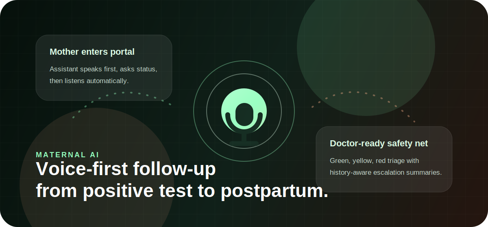
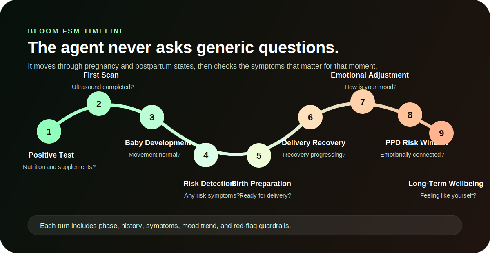
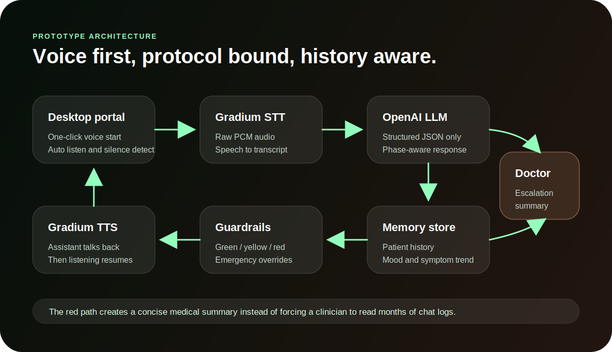
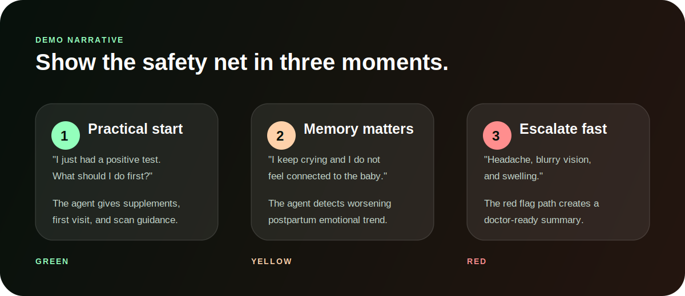

# MATERNAL ai



**MATERNAL ai is a voice-first maternal safety-net prototype for pregnancy and postpartum follow-up.**

It is not a generic pregnancy chatbot. The product behaves like a protocol-bound conversational agent: it follows a mother through the BLOOM maternal journey, remembers patient history, classifies risk as green/yellow/red, and creates a doctor-ready escalation summary when red flags appear.

## Product Story

A mother should not have to know what to ask, what symptom matters, or when something has crossed from normal discomfort into risk. MATERNAL ai starts the check-in by voice, asks phase-aware questions, listens for symptoms and emotional signals, and turns the conversation into structured safety routing.

The hackathon prototype proves four things:

- A mother can enter the portal and begin a voice-led check-in with one browser permission click.
- Gradium STT and TTS create a hands-free conversation loop after the session starts.
- OpenAI returns structured maternal triage instead of free-form chatbot output.
- Patient memory makes the product valuable over time because mood, confidence, symptoms, and red flags can be compared across check-ins.

## What We Are Pitching

**MATERNAL ai is a practical clinical safety net with emotional intelligence, not only a mental health chatbot.**

The core pitch is practical: reduce missed follow-ups, detect risk early, and save clinician time with structured escalation summaries. The emotional layer is the differentiator: postpartum depression and anxiety often appear as gradual changes, so the product tracks tone, confidence, isolation, connection to baby, and repeated concerns over time.



## Live Demo Flow

When the app opens, a voice gate appears. The browser requires one user gesture before microphone access and audio playback can begin. After that click, MATERNAL ai speaks first, listens automatically, detects silence, sends speech to Gradium STT, runs the check-in, speaks the response with Gradium TTS, and resumes listening unless the case is red.

```text
Mother enters portal
  -> clicks Start voice check-in once
  -> assistant asks status out loud
  -> browser records speech until silence
  -> Gradium STT returns transcript
  -> BLOOM phase and patient history are loaded
  -> OpenAI returns structured JSON triage
  -> deterministic guardrails check red flags
  -> local memory is updated
  -> Gradium TTS speaks the response
  -> red cases create a doctor escalation summary
```



## Demo Narrative

Use the demo as a story, not a feature tour. Start with a normal pregnancy question, show memory across emotional check-ins, then trigger an urgent red-flag escalation.



<details>
<summary><strong>Suggested 2-minute video script</strong></summary>

1. Open with the problem: "Pregnancy and postpartum follow-up is fragmented. Mothers often do not know which symptoms are urgent, and doctors do not have time to read long chat histories."
2. Start the app and click **Start voice check-in**: "MATERNAL ai is voice first. The assistant talks first and guides the mother through the check-in."
3. Show a green scenario: "I just had a positive pregnancy test. What should I do first?" Point to phase-aware practical guidance.
4. Show a yellow scenario: "I keep crying and I do not feel connected to the baby." Point to memory and postpartum mood trend.
5. Show a red scenario: "I have a bad headache, blurry vision, and swelling." Point to deterministic red-flag escalation and doctor summary.
6. Close with the thesis: "This is not a chatbot. It is a maternal safety net that listens, remembers, triages, and escalates."

</details>

<details>
<summary><strong>What the prototype currently supports</strong></summary>

- Voice-first check-ins using Gradium STT.
- Spoken assistant responses using Gradium TTS.
- OpenAI structured maternal triage.
- BLOOM phase-aware questioning across pregnancy and postpartum.
- Persistent per-patient history in local JSON storage.
- Longitudinal mood, confidence, symptom, and signal tracking.
- Deterministic red-flag guardrails on top of the model.
- Doctor escalation payloads for urgent cases.
- Desktop demo UI with dynamic voice, triage, and memory visuals.

</details>

## Run Locally

```bash
cd /Users/reegauta/Documents/Maternal.ai
npm run dev
```

Open:

```text
http://127.0.0.1:3000
```

If port `3000` is busy:

```bash
PORT=3001 npm run dev
```

Then open:

```text
http://127.0.0.1:3001
```

## Environment Variables

Create `.env` from `.env.example` and fill your keys locally. Secrets are ignored by git. Do not commit `.env`.

```bash
OPENAI_API_KEY=
OPENAI_MODEL=gpt-4o-mini

GRADIUM_API_KEY=
GRADIUM_STT_URL=https://api.gradium.ai/api/post/speech/asr
GRADIUM_TTS_URL=https://api.gradium.ai/api/post/speech/tts
GRADIUM_VOICE_ID=YTpq7expH9539ERJ

SLNG_API_KEY=
SLNG_AGENT_ID=
SLNG_BASE_URL=

PIONEER_API_KEY=
PIONEER_API_URL=

FAL_KEY=
FAL_API_URL=
```

## How To Test

### Voice-first path

1. Open `http://127.0.0.1:3000`.
2. Click **Start voice check-in**.
3. Allow microphone permission.
4. Wait for the assistant greeting.
5. Speak naturally and stop talking.
6. The app detects silence, transcribes, sends the check-in, speaks the answer, and listens again.

### Manual backup path

If the room is noisy or browser audio permissions interfere with the demo, use the text box and preset buttons. The prototype includes three preset flows:

- **Positive test**: practical early pregnancy support.
- **PPD trend**: postpartum emotional monitoring and memory update.
- **Emergency**: late-pregnancy red flag escalation.

## API Endpoints

```text
GET  /api/health                  Runtime and integration status
GET  /api/history?patientId=...    Patient memory snapshot
POST /api/history/reset            Reset one demo patient
POST /api/checkin                  Run structured triage
POST /api/transcribe               Gradium STT proxy
POST /api/speak                    Gradium TTS proxy
POST /api/visual                   Optional fal.ai visual generation hook
```

## Local Data

```text
data/memory.json
data/checkins.jsonl
data/escalations.jsonl
data/pioneer-events.jsonl
```

The `data/` directory is ignored by git.

## Safety Position

This is a hackathon prototype, not a medical device.

The assistant must not diagnose, replace a doctor, replace emergency services, or replace clinical care. Red/yellow/green triage is a safety-routing mechanism for demo purposes. The deterministic guardrail layer exists so obvious red flags cannot be silently downgraded by the model.

## Project Structure

```text
public/                 Desktop web UI
src/bloom.js            BLOOM phases and question bank
src/gradium.js          Gradium STT/TTS integration
src/openai.js           Structured OpenAI triage call
src/memory.js           Local patient history store
src/triageRules.js      Deterministic red-flag guardrails
server.mjs              Node server and API routes
docs/images/            README story visuals
```

## Free Hosting Recommendation

Use Render Free Web Service for this prototype because it runs a normal Node server. Set:

```text
Build Command: npm install
Start Command: npm run start
Environment: Node
```

Add the same environment variables from `.env` in the Render dashboard. If the host requires public binding, set `HOST=0.0.0.0`.

## Verify

```bash
npm run check
node --check public/app.js
node --check server.mjs
```
